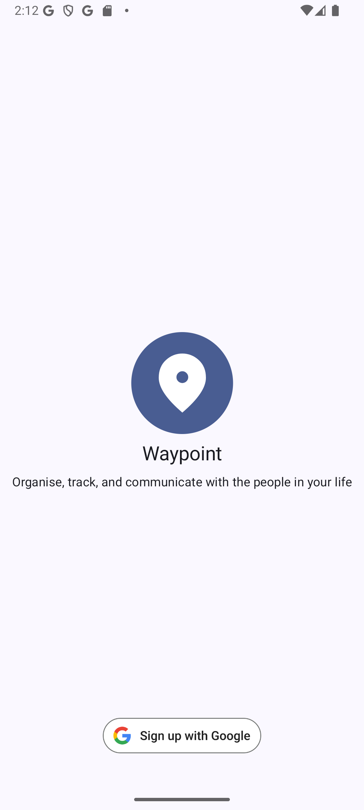
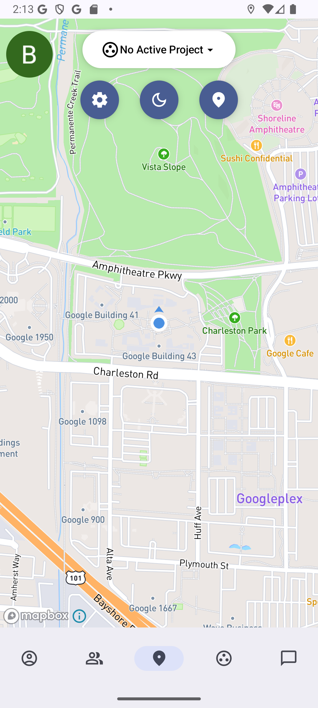
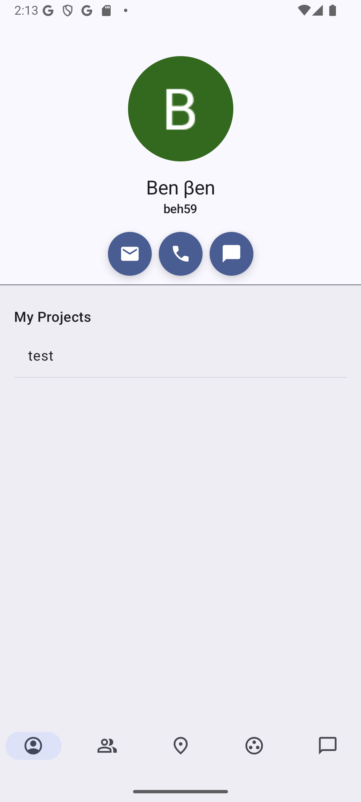

## Waypoint

<table>
  <tr>
    <td align="center">
      
    </td>
    <td align="center">
      
    </td>
    <td align="center">
      
    </td>
  </tr>
</table>

A native Android application for real-time location sharing with friends. See live locations on a dynamic map, chat in real-time, and use the unique Projects system to organize group events and assign tasks.

This project was developed as a final year dissertation, showcasing a feature-rich application built following modern Android development best practices.

## Features

- Real-time location sharing  
- Friends system  
- Dynamic map with live friend locations  
- Chat functionality  
- Projects system for group events and task assignments

## Tech Stack & Architecture
- Language: 100% Kotlin
- UI: Jetpack Compose
- Architecture: MVVM (Model-View-ViewModel) & Google's recommended Clean Architecture
- Asynchronous: Kotlin Coroutines & Flows for state management and background tasks
- Backend & Real-time: Google Firebase (Authentication, Firestore, Realtime Database).
- Mapping: Mapbox SDK
- Dependency Injection: Hilt & Dagger
- Asynchronous Image Loading: Coil

## Build instructions

To build and use the app, you will need a Firebase project and a Mapbox access token, as well as a Google account signed in to the Android device.

1. Clone the repository: https://github.com/Ben-TH-Dev/Waypoint.git
2. Open the repository in Android Studio and allow the Gradle sync to complete.
3. Set up your Firebase project, ensuring the package name of the application is set to `beh59.aber.ac.uk.cs39440.mmp`. This project makes use of Authentication, Firestore and the Realtime Database. 
4. Set up your debug or release keystores and upload the SHA certificate fingerprints to the Firebase console.
5. Enable Google Sign-In in Firebase Authentication.
6. Download `google-services.json` from the Firebase console and place it in the app/ directory.
7. In File Explorer, navigate to app/src/main/res/values and create a file called `developer_config.xml`.
8. Open the file and add this text:
```
<?xml version="1.0" encoding="utf-8"?>
<resources>
    <string name="mapbox_access_token">your-mapbox-access-token-here</string>
    <string name="default_web_client_id">your-google-web-client-id-here</string>
    <string name="firebase_realtime_db_url">your-realtime-database-url-here</string>
</resources>
```
9. Replace 'your-mapbox-access-token-here' and 'your-google-web-client-id-here' with the correct respective values.
10. Run the application.
11. If you wish to build the app as a signed release in Android Studio, create a release keystore and replace these null values in `gradle.properties` with the respective values:
```
KEYSTORE_PASSWORD=null
KEY_PASSWORD=null
KEY_ALIAS=null
KEY_PATH=null
```

Built with:
- Android Studio Meerkat Feature Drop | 2024.3.2 Patch 1
- Gradle 8.9
- Android Gradle Plugin 8.7.3

## License

Copyright 2025 Benjamin Thomas Hull

Licensed under the Apache License, Version 2.0 (the "License");
you may not use this file except in compliance with the License.
You may obtain a copy of the License at

    [http://www.apache.org/licenses/LICENSE-2.0](http://www.apache.org/licenses/LICENSE-2.0)

Unless required by applicable law or agreed to in writing, software
distributed under the License is distributed on an "AS IS" BASIS,
WITHOUT WARRANTIES OR CONDITIONS OF ANY KIND, either express or implied.
See the License for the specific language governing permissions and
limitations under the License.
